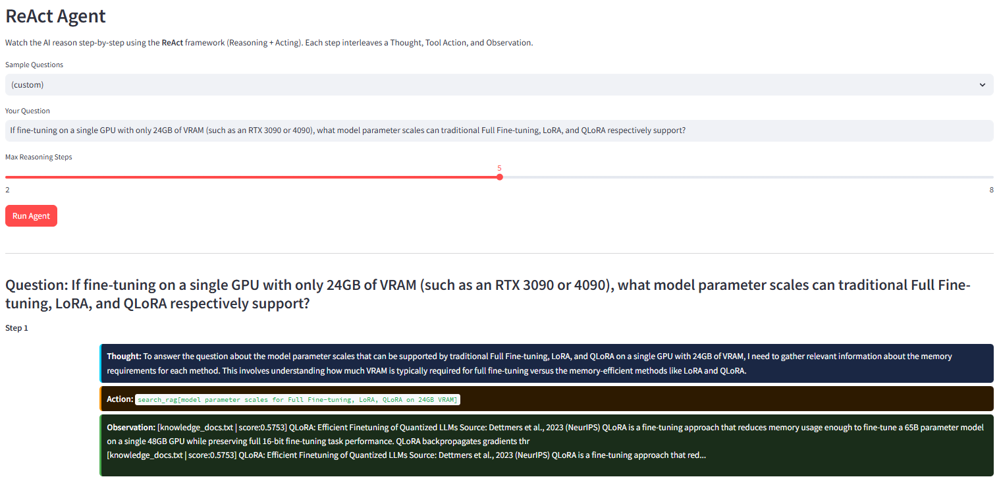

# ML Portfolio Demo

A locally runnable **Streamlit** portfolio site that showcases **QLoRA fine-tuning**, **multimodal RAG**, a **ReAct reasoning agent**, and **Llama Prompt Guard** workflows. The project targets a consumer-grade **RTX 3050 with 4 GB VRAM** to prove that end-to-end ML engineering can run on limited memory.

---

## What This Project Does

This is a clickable, viewable, runnable interactive demo that packages common paper concepts (quantization + LoRA, RAG, and ReAct) into **7 tabs**. From training and retrieval to agent reasoning and safety classification, everything is in one app. You can experience the full story in sequence: **why QLoRA saves VRAM -> how training works -> how to compare results -> how knowledge base + graph support answers -> how ReAct retrieves step by step -> how charts and manual complete the narrative**.

---

## What You Can Do (Feature Overview)

| Tab | What you can do | GPU Required |
|------|------------|:-------------:|
| QLoRA Training | Fine-tune TinyLlama-1.1B with 4-bit NF4, monitor live **loss curves** and **VRAM**, and tune steps/learning rate/LoRA rank | ✓ |
| Model Compare | Compare **base model vs fine-tuned model** responses side by side | ✓ |
| RAG Pipeline | Multimodal ingestion (Whisper + BLIP) -> ChromaDB query; inspect **knowledge graph** (entities and relations) | Depends on feature |
| ReAct Agent | Use custom or sample questions and view step-by-step **Thought -> Action (e.g., `search_rag`) -> Observation** trace | Demo mode available |
| Experiment Results | View **5 Plotly charts** (including simulated 8B/70B comparisons) for VRAM, loss, quality radar, and more | — |
| Manual | Built-in full English usage guide | — |
| Prompt Guard | Run Llama **Prompt Guard** inference, safe/injection classification, and Full FT vs QLoRA comparison | ✓ |

> **Experiment charts:** values such as 8B/70B are **precomputed simulated data aligned with research trends** (with footnotes to Dettmers et al. 2023 and Zheng et al. 2023). **Local live training** is based on TinyLlama 1.1B and corresponds to the "Live" marker in charts.

---

## UI Preview (`demo_image/`)

These screenshots map directly to real tabs and charts, so you can quickly understand what you will see after launching the web app.

### Main Screen: QLoRA Training and Live Monitoring

The sidebar shows GPU memory and environment info. In the main area, you can choose base model settings and tune **Max Steps / Learning Rate / LoRA r**, with live updates of **loss** and **VRAM**.


### Experiment Results: Training Loss and VRAM Needs (Simulated Curves Included)

Comparison charts aligned with paper trends: QLoRA vs Full FT, different model scales, and this project's **Live Demo (1.1B)** position.


### Experiment Results: Response Quality Radar and Key Insights

Compare **Base / QLoRA / Full FT (simulated)** across Coherence, Instruction Following, Relevance, Fluency, and Factuality. The summary highlights narratives like **~8x VRAM savings** and **~99.3% quality retention** (please treat chart footnotes as the final source).


### RAG: Knowledge Graph Visualization

Concepts are extracted from documents as nodes and edges, and can be colored by **Degree (number of connections)** to help understand knowledge structure and retrieval context.


### ReAct Agent: Thought / Action / Observation

You can enter custom questions and adjust maximum reasoning steps. Each step shows **thoughts, tool actions (e.g., `search_rag`), and observations**, demonstrating how the agent answers technical questions from the knowledge base.



---

## Features

| Tab | Feature | GPU Required |
|-----|---------|:------------:|
| QLoRA Training | Fine-tune TinyLlama-1.1B in 4-bit NF4 with live loss curve + VRAM monitor | ✓ |
| Model Compare | Side-by-side base vs fine-tuned response comparison | ✓ |
| RAG Pipeline | Multimodal ingestion (Whisper + BLIP) -> ChromaDB -> Knowledge Graph query | — |
| ReAct Agent | Step-by-step Thought / Action / Observation reasoning trace | — |
| Experiment Results | 5 Plotly charts (loss, VRAM, quality radar, perplexity, Pareto) | — |
| Manual | Full English user guide embedded in the app | — |
| Prompt Guard | Llama Prompt Guard inference + Full FT vs QLoRA RAM comparison | ✓ |

---

## Hardware

| Item | Spec |
|------|------|
| GPU | NVIDIA RTX 3050 Laptop — **4 GB VRAM** |
| RAM | 15 GB |
| CPU | AMD Ryzen 6C / 12T |
| CUDA | 12.5 (PyTorch cu121) |
| Python | 3.9.12 |
| OS | Windows 11 |

> **Why 4 GB?** Many QLoRA demos assume 24-80 GB VRAM. This project intentionally targets a consumer GPU to show how **4-bit quantization + LoRA** makes local fine-tuning feasible.

---

## Tech Stack

| Category | Library | Version |
|----------|---------|---------|
| Training | PyTorch | 2.3.1+cu121 |
| Training | Transformers | 4.44.2 |
| Training | PEFT | 0.12.0 |
| Training | bitsandbytes | 0.43.3 |
| Training | TRL (SFTTrainer) | 0.10.1 |
| RAG | ChromaDB | 0.5.5 |
| RAG | sentence-transformers | 3.0.1 |
| RAG | LangChain | 0.2.16 |
| RAG | NetworkX | 3.x |
| Audio | OpenAI Whisper | 20231117 |
| Image | Salesforce BLIP | via Transformers |
| UI | Streamlit | 1.38.0 |
| Charts | Plotly | 5.24.1 |
| Monitoring | pynvml + psutil | — |

---

## Installation

### Prerequisites
- NVIDIA GPU with CUDA 11.8+ driver
- Python 3.9–3.11
- [ffmpeg](https://ffmpeg.org/download.html) in PATH (for audio transcription)

### Steps

```bash
# 1. Clone
git clone https://github.com/<your-username>/ml-portfolio-demo.git
cd ml-portfolio-demo

# 2. Run install script (creates venv and installs packages in proper order)
install.bat

# 3. (Optional) Set HuggingFace token for gated models
cp .env.example .env
# Edit .env -> HF_TOKEN=hf_xxxxxxxxxxxx
```

> **Why a separate venv?** Installing into Anaconda base can cause numpy ABI conflicts with scikit-learn. The install script automatically creates an isolated `venv/`.

### Manual Install (If Needed)

```bash
python -m venv venv && venv\Scripts\activate

# PyTorch CUDA (install first — sets C++ ABI)
pip install torch==2.3.1+cu121 --extra-index-url https://download.pytorch.org/whl/cu121

# QLoRA stack
pip install bitsandbytes==0.43.3
pip install transformers==4.44.2 peft==0.12.0 accelerate==0.34.2 trl==0.10.1

# RAG stack
pip install chromadb==0.5.5 sentence-transformers==3.0.1
pip install langchain==0.2.16 langchain-community==0.2.16

# App stack
pip install streamlit==1.38.0 plotly==5.24.1 pynvml==11.5.0 psutil==5.9.8 python-dotenv==1.0.1 networkx

# Audio (needs ffmpeg binary)
pip install openai-whisper==20231117 --no-build-isolation

# Generate pre-computed experiment charts
python utils/generate_experiment_data.py
```

---

## Usage

```bash
# Double-click run.bat, or:
venv\Scripts\activate
streamlit run app.py
```

Open http://localhost:8501

---

## Demo Walkthrough

Suggested order for demos or interviews:

```
1. Experiment Results — establish "why QLoRA" intuition (VRAM, loss, quality radar)
2. QLoRA Training     — load TinyLlama and start training (background thread + live loss)
3. RAG Pipeline       — while training runs, process docs, view graph, run semantic queries
4. ReAct Agent        — show Thought / Action / Observation (demo mode available)
5. QLoRA Training     — return after completion and save adapter
6. Model Compare      — base vs fine-tuned side-by-side (key highlight)
7. Prompt Guard       — injection example classification + Full FT vs QLoRA comparison charts
```

---

## Project Structure

```
ml-portfolio-demo/
├── app.py                              # Streamlit entrypoint (multi-tab app)
├── requirements.txt
├── install.bat                         # One-click environment setup
├── run.bat                             # One-click app launch
├── demo_image/                         # Screenshots for README/documentation
├── .env.example                        # HF_TOKEN template
│
├── core/
│   ├── model_manager.py                # 4-bit load/unload/generation
│   ├── qlora_trainer.py                # Background-thread QLoRA training + queue
│   ├── rag_pipeline.py                 # Whisper + BLIP + ChromaDB + NetworkX
│   ├── react_agent.py                  # ReAct Thought/Action/Observation
│   ├── vram_monitor.py                 # pynvml + psutil background monitoring
│   ├── prompt_guard.py                 # Prompt Guard wrapper
│   └── prompt_guard_trainer.py         # Full FT vs QLoRA training comparison
│
├── tabs/
│   ├── tab_qlora.py
│   ├── tab_compare.py
│   ├── tab_rag.py
│   ├── tab_agent.py
│   ├── tab_charts.py
│   ├── tab_manual.py
│   └── tab_prompt_guard.py
│
├── utils/
│   ├── chart_builder.py
│   └── generate_experiment_data.py
│
└── data/
    ├── train_data/
    │   ├── alpaca_tiny.json
    │   └── prompt_guard_dataset.json
    ├── rag_docs/knowledge_docs.txt
    └── precomputed/
        └── experiment_results.json
```

---

## Key Design Decisions

**4-bit NF4 quantization (QLoRA)**  
Weights are stored in NormalFloat4 format to drastically reduce VRAM usage, making fine-tuning demos possible on 4 GB VRAM.

**Background thread training**  
`QLoRATrainer.run()` executes in a background thread to avoid blocking the Streamlit event loop; progress is sent back to UI through `queue.Queue` polling.

**Lazy loading**  
Whisper, BLIP, sentence-transformers, and Prompt Guard load on first use to reduce cold-start latency.

**Simulated experiment data**  
Values for 8B/70B charts are precomputed and annotated with literature references (Dettmers et al. 2023, Zheng et al. 2023).

---

## Acceptance Criteria

- [ ] `streamlit run app.py` starts without ImportError
- [ ] Tab 5 charts render without GPU
- [ ] Tab 6 manual renders without GPU
- [ ] Tab 1: Load TinyLlama -> VRAM < 700 MB
- [ ] Tab 1: Train 50 steps -> loss decreases, no OOM
- [ ] Tab 3: Index knowledge base -> ChromaDB count > 0
- [ ] Tab 3: Query returns relevant chunks with scores
- [ ] Tab 4: ReAct demo mode completes 2-step trace
- [ ] Tab 7: Prompt Guard classifies injection examples correctly
- [ ] Tab 7: Full FT and QLoRA training both complete 30 steps
- [ ] Tab 7: QLoRA peak VRAM lower than Full FT peak VRAM

---

## References

- [QLoRA: Efficient Finetuning of Quantized LLMs](https://arxiv.org/abs/2305.14314) — Dettmers et al., 2023
- [ReAct: Synergizing Reasoning and Acting in LLMs](https://arxiv.org/abs/2210.03629) — Yao et al., 2022
- [Judging LLM-as-a-Judge with MT-Bench](https://arxiv.org/abs/2306.05685) — Zheng et al., 2023
- [Llama-Prompt-Guard-2-86M](https://huggingface.co/meta-llama/Llama-Prompt-Guard-2-86M) — Meta, 2025
- [LIMA: Less Is More for Alignment](https://arxiv.org/abs/2305.11206) — Zhou et al., 2023
